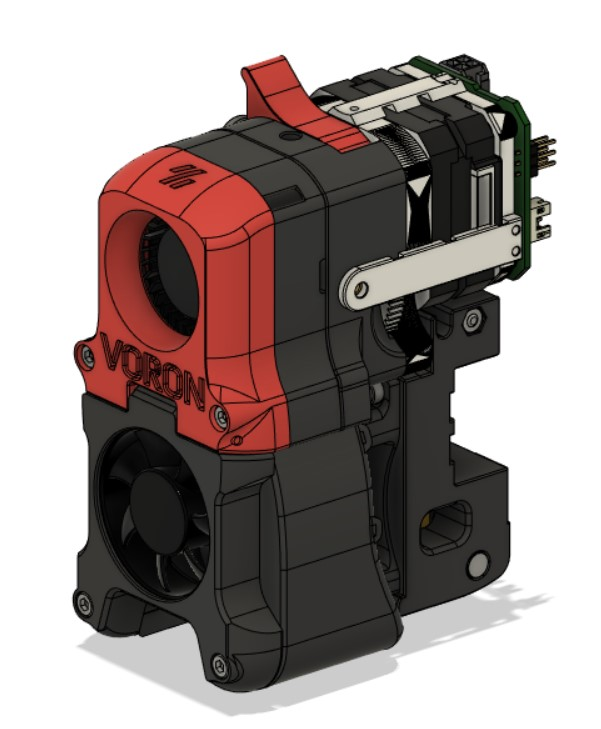
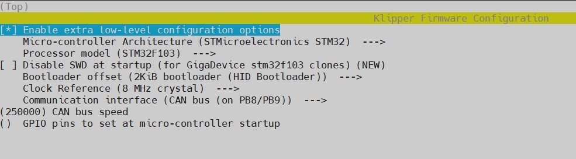
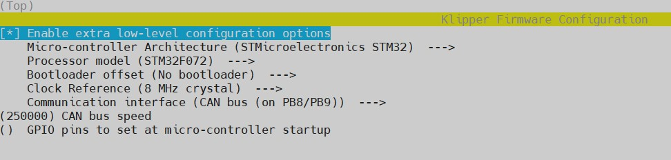
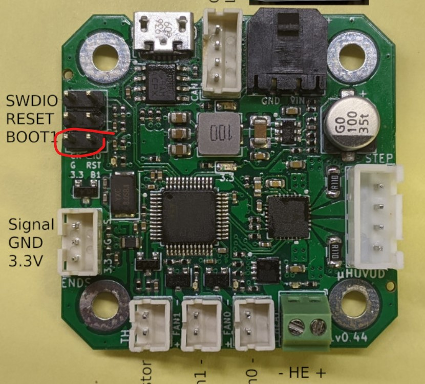
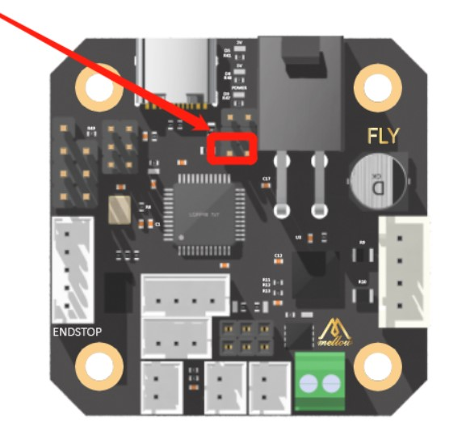
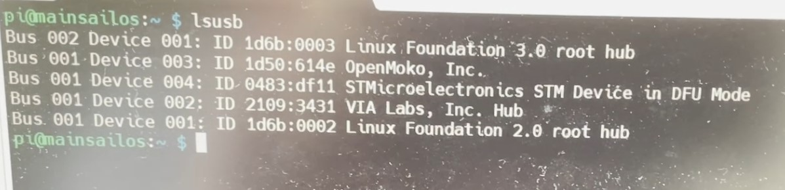

# CAN Bus Board Mount
 
This mod allows you to mount your HUVUD board side of the afterburner or stealthburner. 
If you are using umbilical cable you can also strain relief.  



**BOM:**
| Material                   | Quantity |
| -------------------------- | -------- |
| M2x10  Self Tapping Screw  |        5 |
| M3x8 Screw                 |        1 |

 
## Commissioning of CAN Bus Board
**Video:**
[](https://www.youtube.com/watch?v=CXDnr3mxAWE)

1. Create can0 file under interface.d on raspberry pi:
   - Send below command in terminal.<br/>
     ```sudo nano /etc/network/interfaces.d/can0```
   - It will create blank text file, paste below in this blank text file.
   - If you want to use 250000 bitrate:
     ```auto can0
       iface can0 can static
          bitrate 250000
          up ifconfig $IFACE txqueuelen 128```
   - If you want to use 500000 bitrate:
     ```auto can0
       iface can0 can static
          bitrate 500000
          up ifconfig $IFACE txqueuelen 128```	
   - Close the editor with CTRL+X and accept the changes.			

2. Edit config file:
   - Send below command in terminal.<br/>
   ```sudo nano /boot/config.txt```<br/>
   - :exclamation: If you are using **mainsail**, delete the lines after '[pi4]' in your config and paste below. If you are not using mainsail skip this one.
   ```
      [pi4]
      # Enable DRM VC4 V3D driver on top of the dispmanx display stack
      dtoverlay=vc4-fkms-v3d
      max_framebuffers=2
      # Do not use more than 256Mb on Pi Model 4, it uses its own Management.
      gpu_mem=256
      
      [all]
      #dtoverlay=vc4-fkms-v3d
      
      # Enable Hardware UART for Serial Communication
      #enable_uart=1
      #dtoverlay=disable-bt
      
      # Enable Raspicam devices at boot
      start_x=1
      gpu_mem=256
      
      ## Zero Models need special handling
      #[pi0w]
      #dtoverlay=pi3-disable-bt
      #gpu_mem=128
      
      #[pi02]
      #gpu_mem=128

   - Paste below line to edn of the config file depending on your oscillator on the can hat board.
        - If it is 8.000 written on the oscillator:
        	 ```enable_uart=1
       dtoverlay=mcp2515-can0,oscillator=8000000,interrupt=25,spimaxfrequency=1000000 
   - Add below line depending on your oscillator on the can hat board.
        - If it is 12.000 written on the oscillator:
        	 ```enable_uart=1
       dtoverlay=mcp2515-can0,oscillator=12000000,interrupt=25,spimaxfrequency=2000000
   - Close the editor with CTRL+X and accept the changes.
3. With first 2 steps your raspberry pi should be ready to use CAN Bus hat. Now you need to create firmware for CAN Bus board.
   - Send below command in terminal.
     ```
	 cd ~/klipper
	 ```
     make clean
     make menuconfig
   - :exclamation: If you are using **HUVUD** board:
   Do the changes like shown in below screenshoot:
   
   - :exclamation: If you are using **CAN Bus board of 3DMellow**:
   Do the changes like shown in below screenshoot:
   
       If you decided yo use 500000 bitrate change 'CAN bus speed' to 500000.
   - Hit 'q', then 'y'.
4. Now the firmware also ready. To be able to flash the board, the board needs to be in bootloader mod. 
   - :exclamation: If you are using **HUVUD** board, put jumper between in highlighted PINs in below picture.  
   
   - :exclamation: If you are using **CAN Bus board from 3DMellow**, put jumper between in highlighted PINs in below picture.  
     
   - Plug the USB cable to the board, and the other side to the raspberry pi.
   - Plug main connector to give 24V to the board.
   - Send below command in terminal. With that you should see the CAN Bus board in boot mode like in screenshoot in below.
     ```
	 lsusb
	 ```
     
   - :exclamation: If you are using **HUVUD** board, send below command in terminal:<br/>
   ```make flash FLASH_DEVICE=1209:beba```
   - :exclamation: If you are using **CAN Bus board from 3DMellow**, send below command in terminal:<br/>
   ```make flash FLASH_DEVICE=0483:df11```
5. Remove the main cable from CAN Bus board. Then remove the jumper that you put. After that plug the main connector again to the CAN Bus board.
6. The CAN Bus board are ready to use. Now we need to find device id of CAN Bus board.
   - Send below command in terminal.<br/>
    ```
    ~/klippy-env/bin/python ~/klipper/scripts/canbus_query.py can0
    ```
   - This will give you like below output: <br/>
   ```
   Found canbus_uuid=<YOUR BOARD'S DEVICE ID>
   ```
   
7. Now we need to define this new board to our klipper environment. For that open your 'printer.cfg' file and add below lines:

```
[mcu th]
canbus_uuid=<YOUR BOARD'S DEVICE ID>
```
8. As a last step, you need to redefine PIN numbers of devices which are connected to your CAN Bus board. Like hotend heater, hotend thermistor, cooling fan, hot end fan,... For this definition, to reference the PIN on the CAN Bus board you need to add the name of your CAN Bus board which is already defined by you(In my case 'th').
Example PIN definition:
``` 
th: PA1
```
You can find PIN pinout of these boards in below links.

**LINK:**
| Addresses                    | 
| -------------------------------- | 
| [Mellow FLY-SHT CAN Bus Board](https://s.click.aliexpress.com/e/_ADbhJh)  |   
| [Waveshare CAN Pi-HAT](https://s.click.aliexpress.com/e/_Af4Q2L)
| [Klipper CAN Bus](https://github.com/Klipper3d/klipper/blob/master/docs/CANBUS.md)                 |    
| [Mellow FLY-SHT CAN Bus Board (Documentation)](http://mellow.klipper.cn/?spm=a2g0o.detail.1000023.73.23e8d2e1GSEFjb#/board/fly_sht36_42/README)                 | 
| [HUVUD Documentation](https://github.com/bondus/KlipperToolboard/blob/master/doc/pinout.md)                 |   