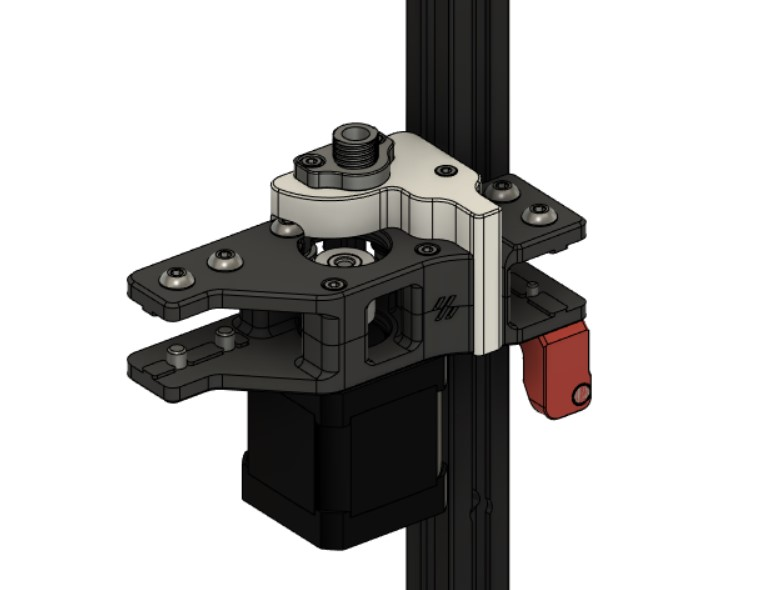

# Cable Cover For Umbilical
 
 This is cable cover on A drive for [Umbilical Strain Relief Mod](https://github.com/hartk1213/MISC/tree/main/Voron%20Mods/Voron%202/2.4/Voron2.4_umbilical_strain_relief).
 The Umbilical mod is not designed Trident at first place, that's why the cable cover in the mod's repository is not compatible with Trident's A drive.

 
 
 **BOM:**
 | Material                | Quantity |
 | ----------------------- | -------- |
 | M3x5x4 Theraded Insert  |        2 |
 | M3x8 Screw              |        2 |
 | M3x12 Screw             |        1 |
 