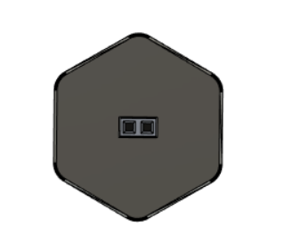
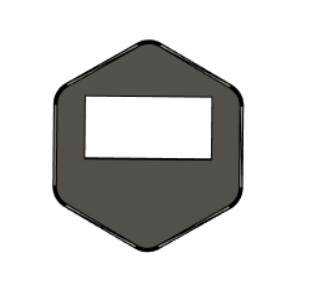

# Connectorized Skirt Inserts

Basic skirt insert with connectors. This mod is based on [this](https://github.com/Ramalama2/Voron-2-Mods/tree/main/ADXL_Skirt_Dupont) mod.
 
 **2 PIN Dupont:**
 
 This one is for BOOT0 PINs of the motherboard. Sometimes klipper updates requires also update on motherboard. And this can be time consuming to open electronics chamber and make short circuit on BOOT0 and 3.3V or puttin SD card. That's why I decided to put 2 PIN male dupont connector on skirt so I can make BOOT0 and 3.3V without accessing electronics chamber. And with that, I just need to give power cycle to enter DFU mode and after that I can flash the motherboard via USB between raspberry pi and motherboard. 

**USB A Port:**
 
 This one is for USB connection. The idea is, using this port for flashing CAN Bus toolhead board without accessing electronics chamber. 

 **BOM:**
| Material               				                        | Quantity |
| ------------------------------------                          | -------- |
| [USB A Port](https://s.click.aliexpress.com/e/_9xHuI9)       	|        1 |
| M3x6 Button Head Screw           				                |        1 |