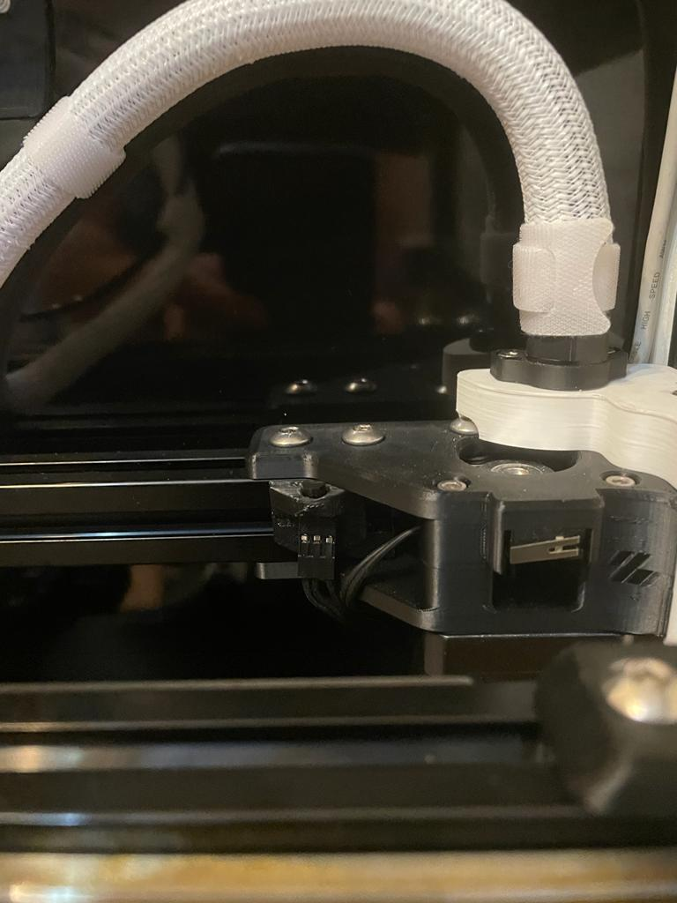
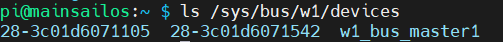

# DS18B20 Multiple Thermistor Mount
 
 DB18B20 is 1-wire thermistor and it is natively supported by klipper. It allows you add thermistor in same 3 wires, which are GND, DATA and Vcc.
 I have placed it near by A drive for chamber and between A and B stepper drivers for electronic chamber. 
 
 
 
 **BOM:**
 | Material               				| Quantity |
 | ------------------------------------ | -------- |
 | M3x6 Screw							|        1 |
 | M3 Roll-in 							|        1 |
 
 **HOW:**
 1. You can follow instruction in [here](https://www.circuitbasics.com/raspberry-pi-ds18b20-temperature-sensor-tutorial/) for wiring.
 2. Send below command via ssh.

     ```sudo nano /boot/config.txt```
 
 3. Paste below line at the end.

    ```dtoverlay=w1-gpio```

 4. Exit and save the editor.
 5. Reboot your raspberry pi with ```sudo reboot```.
 6. Once restart is complete send below command via ssh.
 
    ```sudo modprobe w1-gpio```

     ```sudo modprobe w1-therm```

    ```ls cd /sys/bus/w1/devices```

7. This should give you the device ID of the DB18B20.



8. You need to configure your Raspberry Pi as a mcu. For that you can follow [here](https://www.klipper3d.org/RPi_microcontroller.html).
9. We have ID of device(s) and raspberry also as a mcu. Now, we need to edit config file.
10. Paste below to your config and edit ```PIN``` and  ```serial_no``` with yours.
    ```## Exhaust Fan  
    [temperature_fan chamber]
    pin: YOUR_FAN_PIN_NUMBER
    max_power: 1.0
    shutdown_speed: 0.0
    kick_start_time: 5.0
    cycle_time:0.01
    off_below:0.1
    sensor_type: DS18B20
    serial_no: YOUR_SERIAL_NUMBER  
    sensor_mcu: rpi
    min_temp: 0
    max_temp: 70
    target_temp: 50.0
    control: watermark
    gcode_id: C
As it can be seen I have connected my chamber thermistor to my exhaust fan and defined this one as a ```temperature_fan```. With this, I can set a target temperature and if the temperatur of chamber is bigger that target temperature my exhuast fan start running until it drops to target temperature. The control is not accurate for example like heating bed. For example while printing I set this to 50 C, it set starts once the chamber reaches the ~50 C and it stops when chamber drops to ~45 C. Which is better in my opinion because it reduces start/stop cycle.

11. If you add thermistor also in your electronics chamber paste also below to your config and edit ```PIN``` and ```serial_no``` with yours.
    ```## Electronics Fan 
    [temperature_fan controller_fan]
    pin: YOUR_FAN_PIN_NUMBER
    max_power: 1.0
    shutdown_speed: 0.0
    kick_start_time: 5.0
    cycle_time:0.01
    off_below:0.1
    sensor_type: DS18B20
    serial_no: YOUR_SERIAL_NUMBER   
    sensor_mcu: rpi
    min_temp: 0
    max_temp: 80
    target_temp: 40.0
    control: watermark

12. Send ```FIRMWARE_RESTART``` to your printer via mainsail/fluidd. Now you should have thermistor.
 
 
With below command you can set temperature of the chamber/electronics chamber.
```SET_TEMPERATURE_FAN_TARGET temperature_fan=controller_fan TARGET=50```

```temperature_fan```: What you name in the config.

```TARGET```: Target temperature.


