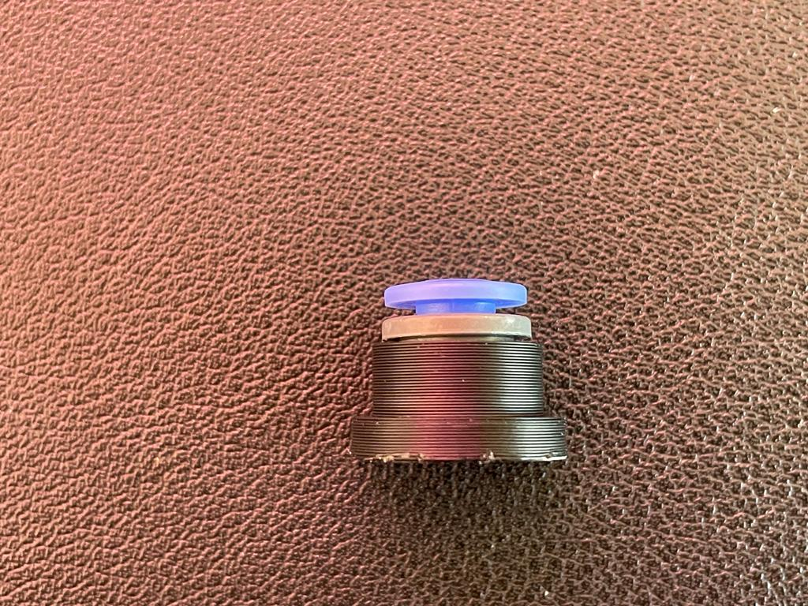

# Exhaust Housing Insert
 
 This is another insert for different type of PTFE push fitting for [Exhaust Housing Mod](https://github.com/VoronDesign/VoronUsers/tree/master/printer_mods/120decibell/exhaust_housing_side_entry).

 I recommend to use litte bit of glue since there is no notch or something like that to hold the push fitting.
 
 