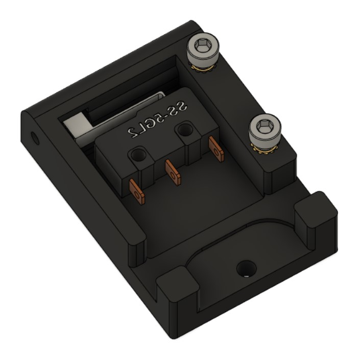

# Filament Runout Sensor
 
  
 
 This is adapted mod from [this](https://github.com/VoronDesign/VoronUsers/tree/master/printer_mods/bobbleheed/Filament_Runout) one.

 I just want to use switch that has ball on its lever. OMRON SS5GL2 is used for that. 
 
 **BOM:**
 | Material                | Quantity |
 | ----------------------- | -------- |
 | OMRON SS5GL2            |        2 |
 | M3x5x4 Theraded Insert  |        2 |
 | M3x8 Screw              |        3 |
 | M2x8 Screw              |        2 |
 
 *(PICTURES and CONFIG WILL BE ADDED LATER ON)*