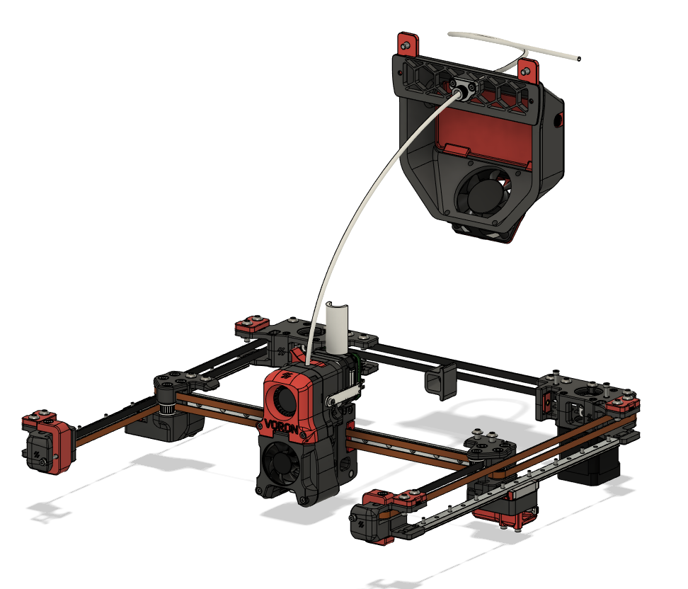
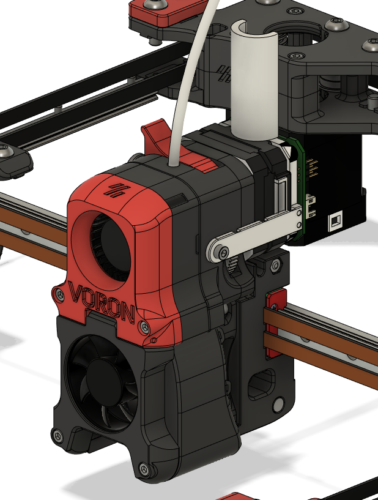
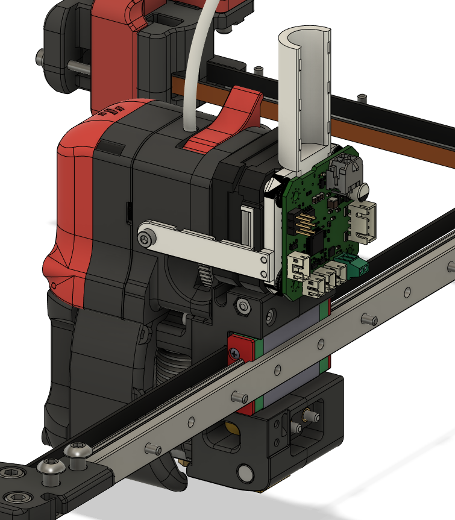

# Umbilical Mod
 
 This is just simple umbilical mod designed for CAN Bus tool head board. 
 
 
 
 

 I have planned to run wires from electronics chamber to exhaust fan grill via inside of the rear right frame. Strain relief is placed on the grill and from there umbilical goes to the toolhead.
 
 **BOM:**
 | Material               				| Quantity |
 | ------------------------------------ | -------- |
 | M3x5x4 Theraded Insert  				|        2 |
 | M3x8 Socket Head Screw              	|        3 |
 | M3x6 Button Head Screw              	|        2 |
 | M3 Nut				            	|        2 |
 | M2x10 Selft TappingScrew             |        2 |
 
