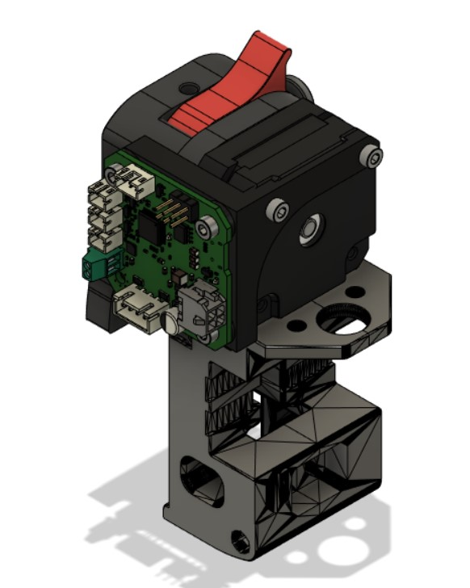
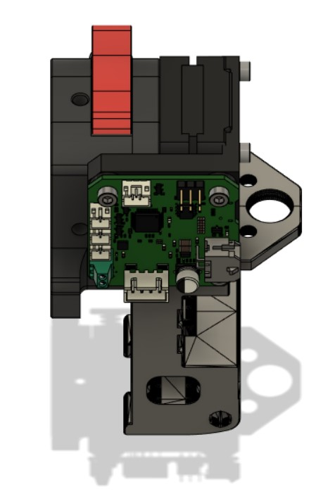

# HUVUD Mount For Umbilical Setup
 
 This is HUVUD mount for using HUVUD with [Umbilical Strain Relief Mod](https://github.com/hartk1213/MISC/tree/main/Voron%20Mods/Voron%202/2.4/Voron2.4_umbilical_strain_relief).

 
 

 This mod allows you to mount your HUVUD board side of the afterburner or stealthburner. With that, you are able to use Umbilical Strain Relief Mod. 
 
 **BOM:**
 | Material                | Quantity |
 | ----------------------- | -------- |
 | M3x5x4 Theraded Insert  |        3 |
 | M3x8 Screw              |        3 |
 | M3x20 Screw             |        2 |
 
 *(PICTURES and CONFIG WILL BE ADDED LATER ON)**