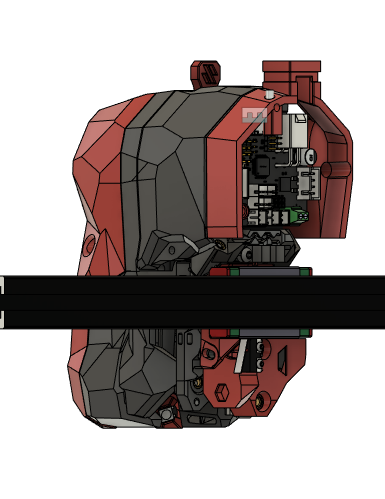

# SB_LGX_Lite_SHT42_Umbilical_Combo
 
 It is designed for using LGX Lite and SHT42 CANBus board on [stealthburner](https://github.com/VoronDesign/Voron-Stealthburner). Also you can add chamber thermistor on your toolhead if you want. 
 It is adapted from [this](https://github.com/Ramalama2/Voron-2-Mods/tree/main/SB_LGXlitePCB) mod.

 
 
 
 
 

 Cable from toolhead is coming from fan grill on Voron 2 You can find STL files of required part in [this](https://github.com/zer0isdoing/Voron_Mods/tree/main/Voron_Trident/Mods/Umbilical_Mod) mod.
 
 The spacer for SHT42 positioned in same orientation.
 
 
 **BOM:**
 | Material               				| Quantity |
 | ------------------------------------ | -------- |
 | M3x5x4 Theraded Insert  				|        5 |
 | M3 Nut				            	|        1 |
 | M3x8 Button Head Screw              	|        3 |
 | M3x6 Button Head Screw              	|        2 |
 
 *Note: You we use couple screw from LGX Lite mount mod for example. Those are not added BOM of this mod.*

